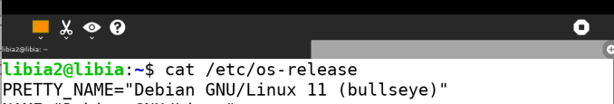
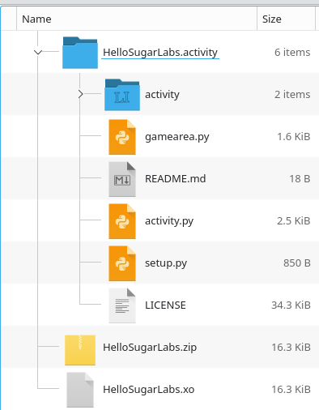
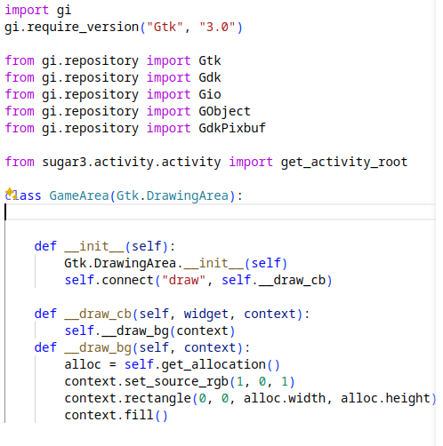
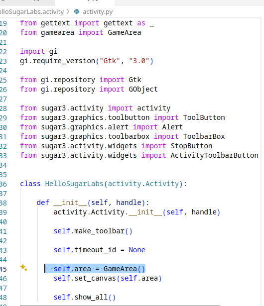
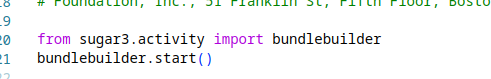
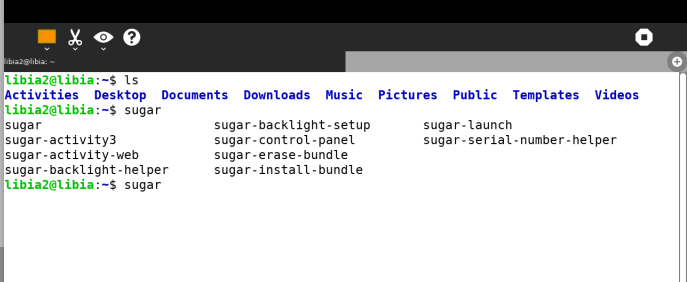
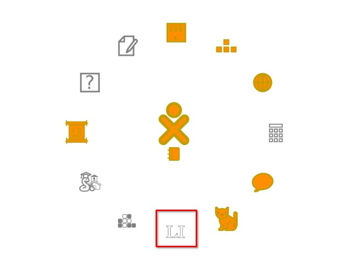

### Develop a SugarActivity

**important** English is not my first language, but I'm happy to share this guide in English.

## Description

In this article, I will use Python3 and sugar-toolkit-gkt3 to create a new "activity".

I found sugar iso based on Fedora [Fedora Sugar on a Stick Spin 40](https://fedoraproject.org/spins/soas/download). However, Sugar could also be used on other Linux distributions (Debian, Fedora, Mandriva, ...).

In my case i used a virtual box with debian11.

Sugar is based on Gtk. There is Gtk version 4 and Gtk version 3.0. I used version 3.

I had to read this [book to create an activity](https://archive.org/details/MakeYourOwnSugarActivities/page/n31/mode/1up?view=theater). Is a pdf with deep detail, but most commands had to be changed.

### Setup 

Install sucrose on Debian: I hope this repo help you. [Sugar on Debian](https://salsa.debian.org/pkg-sugar-team/sugar)

### Structure

### Create the main window 

**gamearea.py**

I only create a window with a color background, This is a secondary script, and I don't like having all my code in one script..

**activity.py**

It is good practice to modularize your code, this is the main script.

At least, but very important. Create the setup.py file.

You can run the python3 script with:

`python3 activity.py`

### Build the .xo file

On the Activities it should have:

binaries: our 3 scripts in Python.

activity: folder of metadata info. Those files are : [activity.info](./activity/activity.info), [activity-icon.svg](./activity/activity-icon.svg)

As a final step, you have to compress all the files using zip, the name of the folder is very important, also the zip, and then rename the file from .zip to .xo.

### Run the activity

you can run your activity using `sugar-install-bundle`

in my case I have all this commands: 

Don´t worry if on the pdf you see (old) commands not available.

### Test the activity

The icon's Activity is now visible at the top of the desktop.

### Resources

Some links that helped me.

https://github.com/sugarlabs/sugargame

https://github.com/sugarlabs/musicblocks/pull/3873

https://sugar3.readthedocs.io/_/downloads/en/latest/pdf/

https://archive.org/details/MakeYourOwnSugarActivities/page/n37/mode/2up?view=theater

https://wiki.sugarlabs.org/go/Tutorials/Installation/Install_with_liveinst#Type_of_installation

https://github.com/Taiko2k/GTK4PythonTutorial

https://wiki.sugarlabs.org/index.php?title=Platform_Team/Package_Management_System&mobileaction=toggle_view_desktop

https://stackoverflow.com/questions/11301074/what-exactly-are-glib-and-gobject

https://gnome.pages.gitlab.gnome.org/pygobject/guide/api/gobject.html
