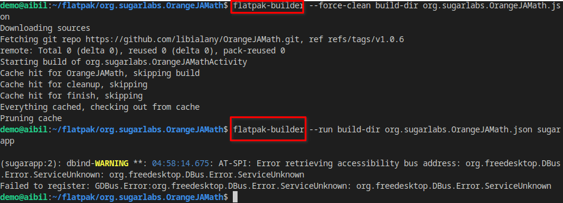

# OrangeJAMath Flatpak

To know more refer https://github.com/libialany/OrangeJAMath.git

## How To Build

```
flatpak-builder --user --force-clean --install build org.sugarlabs.OrangeJAMath.json
flatpak run org.sugarlabs.OrangeJAMath//master
```

 or 

```
flatpak-builder --force-clean build-dir org.sugarlabs.OrangeJAMath.json
flatpak-builder --run build-dir org.sugarlabs.OrangeJAMath.json sugarapp
```

I discovered numerous examples on [Flathub](https://github.com/flathub) when searching for org.sugar.<name-of-activity>.****.

### Useful resources 

learn the parts of a flatpak manifest [Packaging Desktop Apps With Flatpak](https://nora.codes/tutorial/packaging-desktop-apps-with-flatpak/)

how create suggar flatpak [How to port a Sugar application with Sugarapp and package it with Flatpak (by example)](https://github.com/tchx84/sugarapp/blob/master/flatpak-guide.md)

### IMPORTANTE

- Review your activity.info to ensure everything is correct in *.data.xml

- setup environment variables: `SUGAR_BUNDLE_ID=org.sugarlabs.OrangeJAMath SUGAR_BUNDLE_PATH=$PWD` *optional*

### Result

